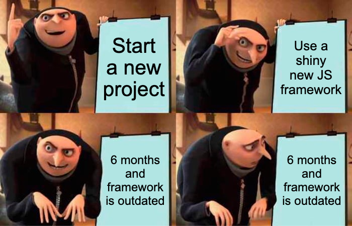
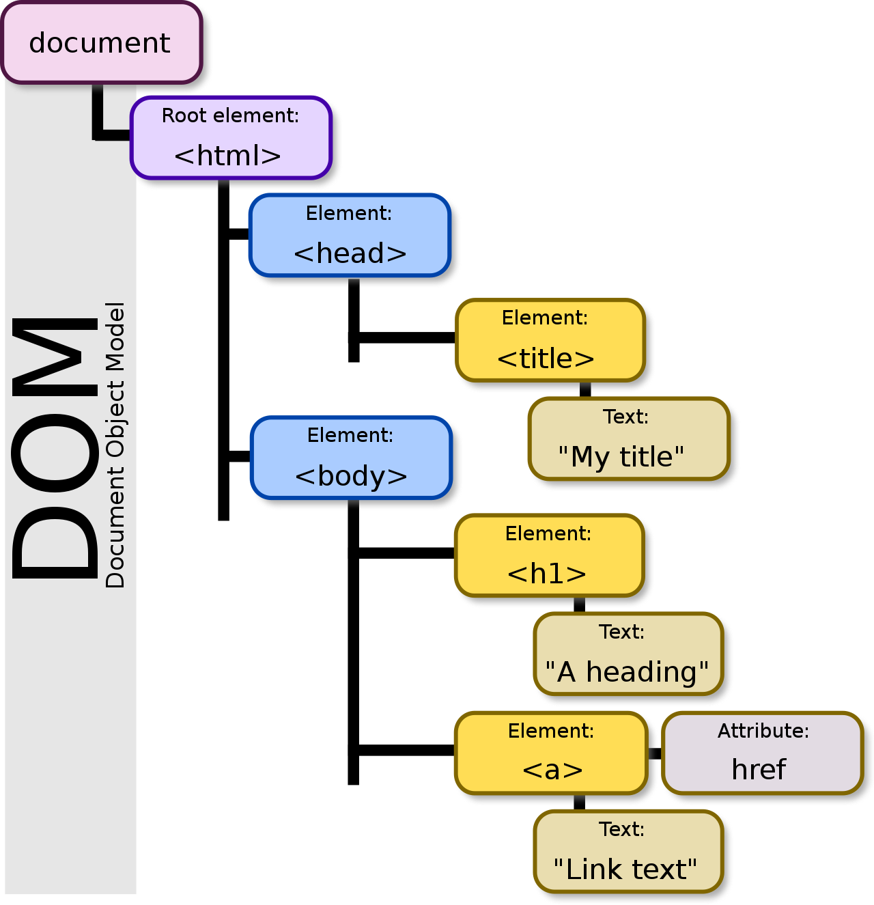

## Introduction

To an end user, what goes on underneath the hood of a website/web application (website) is not their primary concern. They are typically more interested in the actual content of said website. One thing that they will notice though, is if your website is painfully slow to load. To better understand a websites performance, it's important to understand the processes of how website content is rendered and how that rendered content is served to an end-user.

Within this blog, I will be exploring the following topics to better understand the rendering and serving processes of modern day websites:

1. The History of Website Rendering
2. How Website Content is Served to End-Users
3. The Pros/Cons of Single Page Applications (SPAs)
4. How Server Side Rendering (SSR) and Static Site Generation (SSG) Work
5. A Comparison of Performances Between Popular SSR/SSG Javascript (JS) frameworks

## History

These days, many modern day developers have not built a website using raw Hyper-Text-Markup-Language (HTML), Cascading Style Sheets (CSS) and JS. Instead, they are bombarded constantly with shiny new Javascript frameworks which provide an abstraction layer over HTML/CSS/JS.

Historically, websites would be written using raw HTML to provide the overall structure and content of a website. HTML would then create a Document Object Model (DOM) based on the supplied HTML in order to create a hierarchy which the browser would render.

To improve on the appearance of HTML, CSS was introduced, which allowed HTML content to be of websites to be styled and appear better than raw text on a screen. 

And then along came JS. Initially JS was intended for the browser to provide an API for the DOM. For example, a user could interact with a button, which would modify HTML to change how the website was rendered.

There is a lot more history than is naively explained above (INSERT LINK HERE TO BETTER ARTICLE), but the crux of what we are looking to achieve within this blog, is an understanding of what modern day development abstracts away from the developer/end-user. So now lets fast-forward to SPAs.

## How Website Content is Served to End-Users

## Multi-Page Applications

Maybe?

## Single-Page Applications

The date is the 29th of May 2013. Facebook (now Meta) releases ReactJS onto the world. The web-building community rapidly adopts Facebooks love child and begins to run rampant with it, building SPAs that rapidly sprawl across the world wide web. Some believe SPAs to be good, some believe them to be bad, but at the end of the day it is only really important to understand when to use a certain technology and when not to.

So what really is an SPA?

SPAs differ from traditional websites due to the webpage being dynamically rewritten rather than the entire webpage being loaded. On initial launch of an SPA, the majority of HTML/CSS/JS is loaded and is not required to be reloaded again. When interactions take place in the website, the content is loaded via JS from the server and the component listenening to the action is re-rendered.

For example, when a form is submitted in a SPA, the standard flow would be that a loading spinner would be displayed until a response is received from the server. Based on this response, the components listening to the result would be re-rendered and displayed, such as a success or error notification. If this were instead a multi-page-application, the browser would instead have to navigate to an entirely new page to display the content based on the response.

Components -

[comment]: <> (Insert GIF of SPA vs entire page load)
[comment]: <> (https://openclassrooms.com/en/courses/7315991-intermediate-react/7572037-turn-your-application-into-a-single-page-app-with-react-router
https://user.oc-static.com/upload/2021/10/19/16345966448805_image25.png)

### The Good, The Bad

The benefits of SPAs include:

- Performance after initial load - SPAs provide much faster loads compared to MPAs after the initial load of the website, due to not having to load entire pages on every request.
- User Experience - Compared to MPAs, SPA provider a much better user experience due to the
- Bandwidth -
- Caching -
- Developer Experience -

The negatives of SPAs include:

- Performance on initial load -
- Search Engine Optimization -
- Security -
- Developer Experience -

To address some of these issues, JavaScript frameworks such as NextJS, NuxtJS and Sveltekit were introduced, which bring about the benefits of Server-Side Rendering (SSR) and Static Site Generation (SSG).

## Server-Side Rendering and Static Site Generation

Several years later (October 2016) after the relase of ReactJS, NextJS was released as an open-source project. The core features that NextJS introduced as improvements over vanilla React were SSR and SSG.

### Example

SSR is actually a relatively simple concept. Rather than the JS being retrieved from the server and converted by the browser into HTML, it is instead converted to HTML on the server and sent directly to the browser to be rendered.

## SSR/SSG Racing

### Metrics

[comment]: <> (Probably look to use metrics these metrics https://web.dev/performance-scoring/ as well as overall size of bundle. State what metrics will be the main ones)

### Setup

### Frameworks

AWS SSR React
React

React SSR Frameworks
NextJS

Vue SSR Frameworks
Nuxt

Other
Sveltekit

### SSR

| Syntax                                | TTFB | FCP | LCP | Size |
| ------------------------------------- | ---- | --- | --- | ---- |
| React (S3 + Cloudfront)               |      |     |     |      |
| React (S3 + Cloudfront + Lambda)      |      |     |     |      |
| React (S3 + Cloudfront + Lambda@Edge) |      |     |     |      |
| NextJS (Vercel)                       |      |     |     |      |
| NextJS (Amplify)                      |      |     |     |      |
| Nuxt (Vercel)                         |      |     |     |      |
| SvelteKit (Vercel)                    |      |     |     |      |

### SSG

| Syntax             | TTFB | FCP | LCP | Size |
| ------------------ | ---- | --- | --- | ---- |
| NextJS (Vercel)    |      |     |     |      |
| NextJS (Amplify)   |      |     |     |      |
| Nuxt (Vercel)      |      |     |     |      |
| SvelteKit (Vercel) |      |     |     |      |
| Astro |      |     |     |      |
| Gatsby |      |     |     |      |

## Conclusion