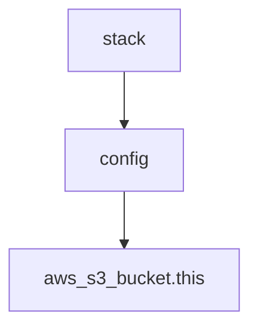

This is the first post in a series on Terraform. In this post, we'll be looking at how we can use a private submodule to encapsulate complicated Terraform configuration. This allows us to separate the construction of our resource configuration from the resource definitions themselves, and is the first step in enabling true Terraform unit testing.

## The Problem

Terraform is a great tool for managing cloud infrastructure. It's declarative, and allows us to describe our infrastructure in a way that is both human readable and machine executable. But it's not without its flaws. Earlier verisons of Terraform had very little in the way of data structures and functions, and relied mostly on concrete values. This made it very difficult to write resource definitions that involved complex logic or were an instance of a map of resources.

For better or for worse, we now have a lot of tools at our disposal. At the time of writing Terraform v1.3 provides 116 functions, which does not include expressions, conditionals, splats, dynamic blocks, type conversion, or lifecycle conditions. This is a lot of power, but it also comes with a lot of responsibility.

Terraform does also not support support user-defined functions, so the only option we have to abstract complexity is to create a module.

## Module Best Practices

Modules are at the heart of Terraform. Every separate directory with `.tf` files in it is a module. We declare modules by creating an arbitrary label and pointing to a source. We then pass arguments to the module, which must be defined as matching variables inside.

```hcl
# root configuration

module "my_module" {
  source = "./modules/some_module"
  users = ["john", "jane", "sam"]
  domain_name = acme.io
  # ... Module Arguments 
}
```

And inside the modules we declare the variables.

```hcl
# modules/some_module/variables.tf

variable "users" {
  type = list(string)
}

variable "domain_name" {
  type = string
}
```

If the module contains no resources itself, it won't do much unless we also have an output. Like a stateless function needs a return statement.

```hcl
# modules/some_module/main.tf

locals {
  accounts = { for user in var.users: user => { 
    username: "${user}@${lower(var.domain_name)}"
  }
}

```

```hcl
# modules/some_module/outputs.tf

output "iam_users" {
  value = local.accounts
}
```

We can then access these outputs as attributes of the module instance in the root configuration.

```hcl
# root configuration

resource "aws_iam_user" "this" {
  for_each = module.my_module.iam_users
  name  = each.value.username
}

```

This resolves to state equivalent to

```hcl

aws_iam_user.this["john"] {
  name = "john@acme.io"
}

aws_iam_user.this["jane"] {
  name = "jane@acme.io"
}

aws_iam_user.this["sam"] {
  name = "sam@acme.io"
}

```

## Definition

- It contains no resources. Only variables, locals and outputs.
- The module must be stateless. Given the same inputs, it will always produce the same outputs.
- The module must require no providers.
  - No credentials, no API calls, no remote plans and applies.
- The output must be human readable.
- The output should be a bill of materials of the resources required.

Then it just becomes an excercise of mapping the config output to the respective resource blocks. These resource definitions should ideally be in the root module, and use a for_each of the configuration output.



## Drawbacks

Every Terraform module has a fairly heavy cost. There are variables to create, type and describe, arguments to provide, mapping variables to locals, mapping locals to outputs and creating and describing the outputs themselves. If your requirements are simple, you'd be better off just writing the resource configuration in either root config, or the resource definitions themselves.

But if you're constantly running Terraform Plan against cloud resources just to see the effects of a change in a local variable, consider giving the config module a try.
