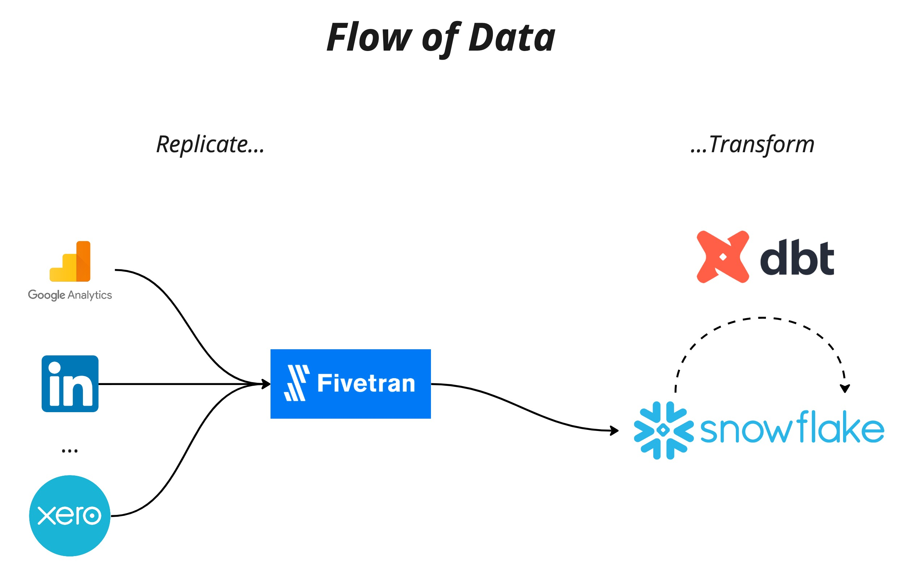
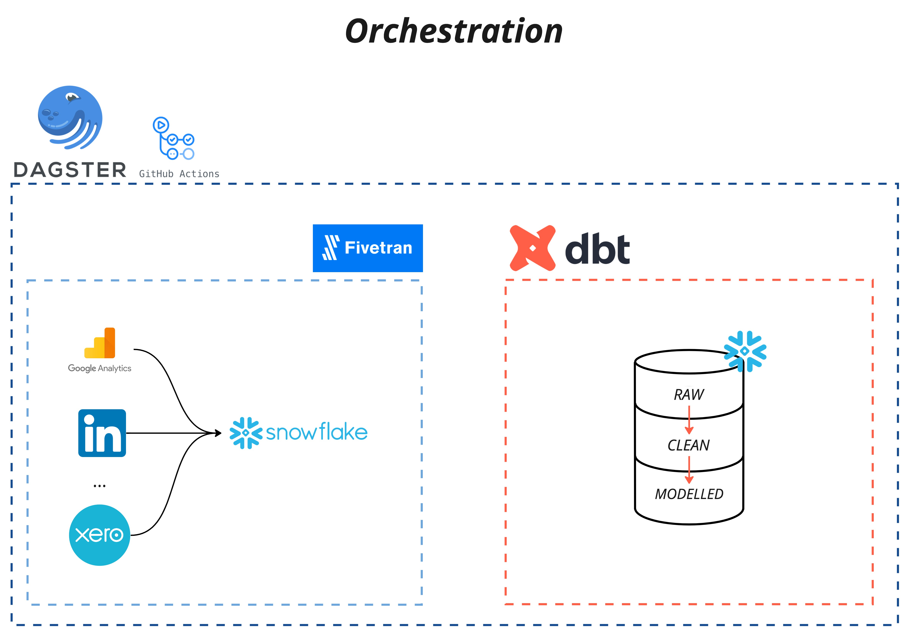
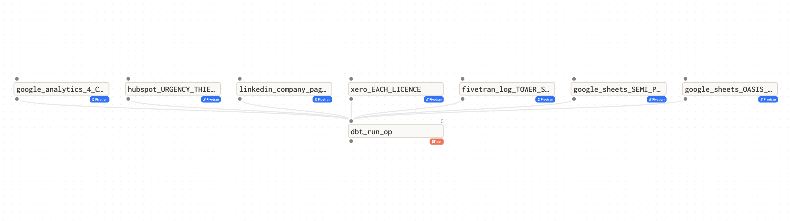

# Building a Lean ‘Modern’ Data Platform

### Introduction

Right now, everyone wants to be data driven and there has been an explosion of tooling to help people do that. However, to become data driven with things like dashboards, reporting, AI and ML, it is paramount that these groan inducing buzzwords are built upon a solid foundation of quality, aggregated and easy to access data. A well engineered data platform is, in my opinion, this solid foundation. For companies looking to effectively aggregate and analyse large amounts of data, building a platform is essential. _Excel sheets can only get you so far._ With a data platform, businesses generally can gain insights into their operations, customer behavior, and market trends. This knowledge can help them make informed decisions and ultimately move closer to becoming data driven.

For Mechanical Rock, we wanted to build, using data-ops practices, an internal data platform that facilitates a few key objectives.

These objectives are the ability to aggregate data from the different SaaS products we use, creating dashboards for some high level metrics, trial a few new technologies and facilitate some level of data analysis. The first three use cases, by some measures, are marked as complete today and the current state of the platform is discussed in this blog.

The good and proper practices of "data-ops" or any other buzz-word to describe good engineering practices include our CI/CD pipelines, governance checks and testing as well as data infrastructure as code.

To create our data platform we leveraged multiple greenfield technologies in order to decrease our time to value as well as minimizing the maintenance cost of the platform. All the while ensuring our dev-ops dream of good engineering practice lives on in the data space.

# Infrastructure

## Designing The Data Platform

In order to build our data platform we needed to load data from our sources and transform it into a usable structure while also ensuring the security of the platform, and thus the data, was up to scratch. To rapidly create this platform while not cutting the corners of these intentions we decided on using the SaaS technologies Snowflake and Fivetran for our storage and data loading respectively. The resources needed could be created both quickly, and more importantly in code, using the Terraform provider for each of these technologies. This, coupled with strong governance, meant our platform and data are secure. However, these tools are not without their drawbacks, and these will be discussed later on. In addition, we are also using DBT for data transformation, which of course is also codified.



The orchestration of Fivetran and DBT is done by Dagster to ensure the dependencies between the two tools is robust.



Our CI/CD pipeline was created with Github Actions, the checks for which ensure that governance policies are maintained and Terraform is (hopefully) working as expected. For our deployments it ensures that the infrastructure is provisioned in a consistent and reliable way with the correct version control as well as change and approval processes.

These technologies enabled us to stand up a lean data platform quickly and efficiently with robust security, CI/CD infrastructure, governance checks and data testing.

### Snowflake Governance ❄️

The foundation of our data platform is the cloud storage technology Snowflake. Utilising the Terraform Snowflake provider to manage, and importantly codify our Snowflake infrastructure ensures that deployments are consistent and repeatable. By using repeatable Terraform modules, we can easily create new resources, onboarding new users, have high visibility of our resources and both track and approve changes through version control in Github. The governance of the infrastructure in Snowflake was also of particular focus for us. This took its form primarily in the creation of a strong RBAC, ensuring that only authorized users have the appropriate write and/or read access to each piece of infrastructure. These access controls are granted to functional and service roles that are used by real users as well as Fivetran and DBT. The result is a secure data platform that follows the security principle of least privilege while also allowing us to get sh\*t done !

An example of this in the way in which the Snowflake Terraform provider allowed us to implement governance with the platform in a highly visible, robust and security focused way. For example, when our RBAC was finalized a Terraform module created our schemas with the appropriate access controls. Here is an example of the call to that module for our MODELLED schema:

```
module "create_modelled_schema_and_grants" {
  source          = "./modules/schema"
  database_name   = snowflake_database.default_domain_database.name
  schema_name     = "MODELLED"
  write_role_name = snowflake_role.write_access_role.name
  read_role_names = sort([snowflake_role.limited_read_access_role.name, snowflake_role.read_access_role.name])
}
```

### Fivetran

Building a data pipeline is hard work that takes a lot of time. Managing pipelines between internal systems alone is difficult, and to ingest data from 3rd party API is even more difficult. Learning and managing the endpoints of an API, setting up correct access, ensuring robust pipelines through testing, deduplication and error notifications is achievable but tough. That is why we chose Fivetran to do this for us. Fivetran is a fully managed service meaning the heavy lifting and headache of building a data pipeline is outsourced to their team and we can focus on other tasks.

In utilizing the Fivetran Terraform provider we were able to have a data pipeline for each of our sources ingest data to our RAW layer within a couple of days rather than a couple of months. The Terraform provider makes it super simple for us to codify a pipeline with the creation of connectors. For example, here is the code used in ingest data from our CRM:

```
resource "fivetran_connector" "crm_name" {
  group_id          = fivetran_group.data_driven_tf.id
  pause_after_trial = false
  paused            = false
  service           = "crm_name"
  sync_frequency    = "360"

  destination_schema {
    name = "raw_crm_name"
  }
}
```

### DBT

For our data transformation we chose the current tool of choice being DBT. This tool allows for data transformations to be written in code, which enables modularity and repeatability. DBT makes transformations more transparent and easier to maintain as they are in code. Further, the documentation capabilities of DBT allow us to ensure that we know the data that we are dealing with, what each transformation calculation is doing and grease the wheels of any handover within this project.

There is nothing worse as an analyst than inheriting a bunch of SQL queries with no documentation and no idea what the source data is or what the transformation is trying to do. DBT enables the documentation and testing of transformation which means that any complex table can ideally have a verbose description of what is going on. This enables analysts to reduce the time wasted on decoding what someone else has done and get stuck into doing higher value work.

### Dagster Orchestration

Similar to the Fivetran Terraform provider, we also wanted to trial the use of Dagster, another somewhat new and green-field technology based around fixing the shortcomings of tools like Airflow. Dagster has various integrations with the aforementioned technology we are already using. In addition, the use of dagster meant we could ensure, in code, that our DBT project was dependent on the success of our Fivetran pipeline data syncs.

Dagster for our purposes was very simple to set up, minimal lines of code are required to create dependencies between Fivetran and DBT. Dagster, which is run on a Github Actions CRON job, first initiates a sync for all Fivetran connectors pointed at our destination and polls them until completion. Once successful the fivetran syncs are complete the DBT project is run, and then finally the tests for the DBT project are executed. Here is a diagram of Dagster and its interactions with Fivetran and DBT.



# Data-Ops

## CI/CD Pipeline

In addition to our infrastructure being defined as code, another form that data-ops practices take in this platform is our continuous integration and continuous delivery pipeline. Running on Github Actions we have two main workflows. The first is for all pull requests to the main branch. This deployment doesn't make any physical changes to our infrastructure, but instead does all the checks and balances to ensure nothing goes wrong when a branch is merged into main (being production). These checks include those discussed above for the Snowflake governance piece of our platform. In addition, they also run Terraform plans, which if successful indicate the proposed changes to be made will be applied successfully. The second workflow is the deployment of changes on the main branch. The steps in this deployment make changes to each Terraform workspace for Snowflake and Fivetran. With this structure we are able to make small incremental changes, which in rare cases they fail, can be rolled back quickly and easily.

## Material outcomes, Ad-hoc Analysis and Dashboard

This was all setup in a couple of months, which could have been significantly longer if we chose some different technologies, in my opinion. We can do ad-hoc analysis however, is yet to be done in a meaningful way. We do plan to complete a customer segmentation piece of analysis in the coming weeks, so stay tuned for that blog. That said, we have a complete and functional dashboard that illustrates our high level metrics.

# Issues & Challenges

## Snowflake Governance

Despite the value add of the Snowflake Terraform Provider, there are some challenges and drawbacks that we have encountered in using it. This is due to the provider being a relatively new technology that is still being developed. In some cases the behavior of the provider is not as expected. For example, if you are making account level grants, using Terraform, to pieces of infrastructure and you have other business units of tenants with that same grant you can revoke the access that others have. To avoid this, it is imperative to check that all grants have the parameter `multiple_grants_enabled` set to `true`. To enforce this you can use the tool `conftest` to check your terraform configuration for this exact parameter across all our snowflake grants. The code for this test can be seen below:

```
package main

arr := ["snowflake_account_grant",
        "snowflake_database_grant",
        "snowflake_external_table_grant",
        "snowflake_file_format_grant",
        "snowflake_function_grant",
        "snowflake_integration_grant",
        "snowflake_masking_policy_grant",
        "snowflake_materialized_view_grant",
        "snowflake_pipe_grant",
        "snowflake_procedure_grant",
        "snowflake_resource_monitor_grant",
        "snowflake_role_grants",
        "snowflake_role_ownership_grant",
        "snowflake_row_access_policy_grant",
        "snowflake_schema_grant",
        "snowflake_sequence_grant",
        "snowflake_stage_grant",
        "snowflake_stream_grant",
        "snowflake_table_grant",
        "snowflake_tag_grant",
        "snowflake_task_grant",
        "snowflake_user_grant",
        "snowflake_user_ownership_grant",
        "snowflake_view_grant ",
        "snowflake_warehouse_grant"]

is_resource_grant(elem) = true {
  arr[_] = elem
} else = false { true }


planned_schema_grants_resources = [ res |
  res := input.resource_changes[_]
  is_resource_grant(res.type)
]

deny[msg] {
  planned_schema_grants_resources[i].change.after.enable_multiple_grants == false
  msg := sprintf("\n\tFor resource: %v \n\tParameter enable_multiple_grants set to: %v, this should be true",[planned_schema_grants_resources[i].address, planned_schema_grants_resources[i].change.after.enable_multiple_grants])
}

```

This runs as one of our safety checks within our pull requests in github to ensure no one's access is revoked unexpectedly.

In addition to this issue, there is some difficulty in troubleshooting errors as sometimes the error message is a red-hearing or is not descriptive enough to understand what went wrong. My personal method of troubleshooting these errors is to reset the terraform state of specific objects and check the Snowflake query logs to understand what the provider was trying to do.

## Fivetran

Similar to the Snowflake Terraform provider, the Fivetran Terraform provider is also in its infancy. The main drawback of this is that some of the functionality available in the Fivetran console has not been brought over to the Terraform provider just yet, however, from discussions with the team at Fivetran, they are working hard to make this a reality so stay tuned!

## Dagster

The integrations in Dagster between each service are ok, fitting our use case but unfortunately stripping us of some control. An example of this is if a Fivetran sync fails silently its status is set to "rescheduled". In these cases, typically following a historical sync, the "rescheduled" sync never occurs. This causes Dagster to poll indefinitely until a timeout occurs. Unfortunately, I have not found a way to resolve this error in Dagster and thus it would be nice to have the ability to catch this polling message however Dagster doesn't allow us to do this. Though I want to emphasize this is an issue with Fivetran not Dagster.

# Conclusion

A solid foundation of quality, aggregated, and easy-to-access data is necessary to even start making decisions that are data-driven. To achieve this, companies need to leverage the best tools available and apply good engineering practices such as data-ops coding practices. The internal data platform we built by leveraging multiple greenfield technologies, such as Snowflake, Fivetran, and DBT. They also utilized the Dagster orchestration tool and created a CI/CD pipeline using Github Actions. While these tools have some drawbacks, they allowed us to create a lean data platform with robust security, governance checks, and data testing. The platform is still in its early iteration, and it will likely change in the future.
